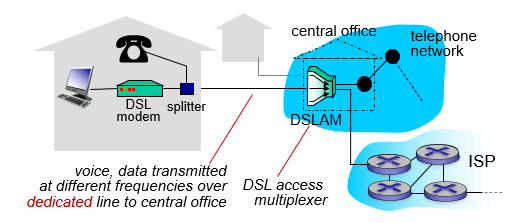
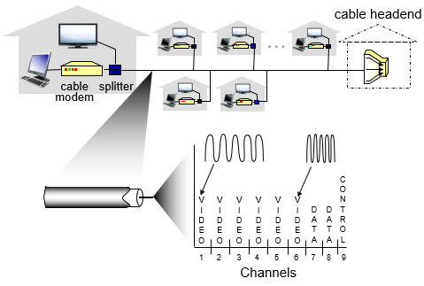
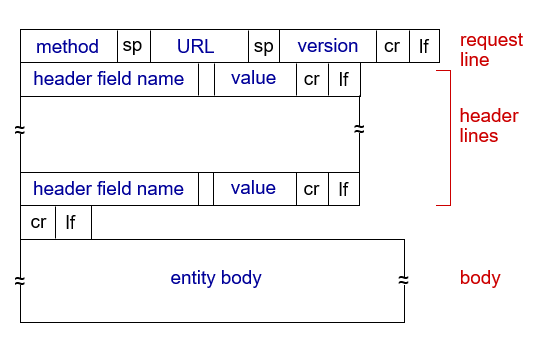
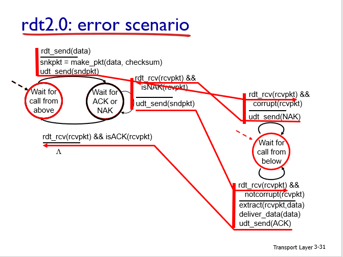
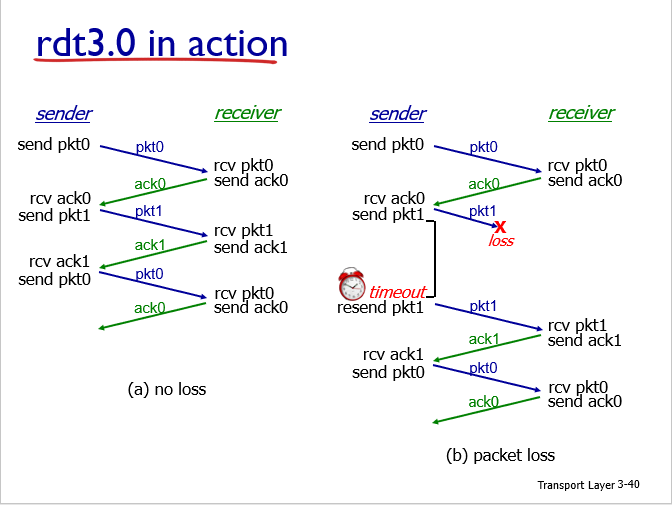

# 
CS 521 Note

## **Chapter 1**
- **What's In Internet** (nuts and bolts view)  
  hardware
  - **hosts/end systems**: connected computing devices, running network apps
  - **communication links**: fiber,copper,radio,satelite. transmission rate(bandwidth) bits/second
  - **packet switches**: routers(core) & switches(access networks)

  software(core)
  - **internet**: network of networks, interconnected ISPs(Internet Service Providers)
  - **protocols**: control sending, receiving of messages. TCP/IP :two most important protocols.(Transmission Control Protocol/Internet Protocol)
  - **internet standards**: RFC(request for comments), IETF(internet engineering task force)

- **Access Technologies**
  - **DSL(digital subscriber line)**
    - Using telephone line(copper wire) for short distance within 5 to 10 miles of the central office.  
    Voice, data transmitted at different frequencies over dedicated line to central office in existing telephone line.  
    The splitter split them, so data over DSL phone line goes to internet, voice over DSL phone line oges to telephone net
    - <2.5 Mbps upstream, <24 Mbps downstream which means **asymmetric**  
  

  - **Cable network**
    - Using television infrastructure, which means duplicated share a cable line
    - HFC: hybrid fiber coax, using both fiber and coaxial cable
    - frequency division multiplexing: different channels transmitted in different frequency bands
    - 30 Mbps downstream, 2 Mbps upstream which is **asymmetric**  
  

  - **FTTH(fiber to the home)**
    - provide an optical fiber path from the CO directly to the home
    - AONs(active optical networks)
    - PONs(passive optical networks), used by Verizon's FIOS service.  
    Using OLT(optical line terminator) to provide conversion between optical and electrical singnals

  - **Wireless**
    - LAN(local area network): within building(100 ft.) 11,54,450 Mbps
    - wide-area wireless access: cellular 10's km 

- **two ways of network link**
  - **circuit switching**
    - a path is reserved during communication between end systems
    - usually use in traditional telephone networks
    - **FDM** Frequency-division multiplexing
    - **TDM** Time-division multiplexing
  - **packet switching**
    - this allow more users to use net work than circuit switching
    - great for bursty data
    - excessive congestion possible

- **packet switching delay**
  - **nodal processing delay**
    - check bit errors, determine output link
    - usually <msec
  - **queueing delay**
    - waiting for transmission
    - depend on congestion level of router
    - **La/R**: traffic intensity
    - R: link bandwidth(bps); L: packet length(bits); a: average packet arrival rate
    - if packet arrive in full buffer(finite capacity), packet will loss
  - **transmission delay**  
    - **L/R**   L:packet length(bits); R: link bandwidth(bps)
  - **propagation delay**
    - **d/s**   d: length of physical link; s: propagation speed(~2*10^8 m/sec)
    - **throughput**: limited by bottlenect link(min)

- **protocol**: define format, order of message sent and received among network entities, and actions taken on message transmission, receipt

- **internet protocol stack** (5 layers)
  - **application**
    - supporting network application
    - FTP(file), SMTP(email), HTTP(web)
    - **message**
  - **transport**
    - process-process data transfer
    - TCP(connection oriented, guaranted), UDP(connectionless)
    - **segment**
  - **network**
    - routing of datagrams from source to destination
    - IP(only), routing protocols(various)
    - **datagram**
  - **link**
    - data transfer between neighboring, network elements
    - ethernet, 802.111(wifi), PPP
    - **frame**
  - **physical**
    - bits "on the wire"

## **Chapter 2**
- **application architectures**
  - **client-server**
    - server: permanent IP address
    - clients: may have dynamic IP addresses
  - **peer-to-peer(P2P)**
    - no always-on server
    - arbitrary end systems directly communicate
    - peers request service from other peers

- **process**
  - program running within a host
  - process(program running within a host) send/receive messages to/from its **socket**
  - process have identifier(32-bit IP address && port numbers)
  - requirements:
    - **data integrity**: file transfer require no loss data
    - **timing**: internet require low delay to be "effective"
    - **throughput**: multimedia require minimum throughput to be "effective"
    - **security**: encryption, data integrity

- **transport layer protocols services**
  - **TCP**
    - reliable transport
    - flow control
    - congestion control
    - does not provide: timing, minimum throughput, guarantee security
    - connection-oriented
  - **UDP**
    - unreliable data transfer
    - does not provide: reliability, flow control, congestion control, timing, throughput guarantee, security, or connection setup.

- **SSL(Secure Sockets Layer)**
  - application layer
  - provides:
    -  encrypted TCP connection
    -  data integrity
    -  end-point authentication

- **HTTP(hypertext transfer protocol)**
  - Web's application layer protocal, **stateless** protocol
  - client/server model
  - use **TCP**: client initiates TCP connection to server port 80, which is also known as **hand shake**
  - non-persistent/persistent HTTP, depends on the number of objects sent over one TCP connection
  - **RTT(round-trip time)**: time for a small packet to travel **from client to server and back** 
  - **HTTP response time**
    - one RTT to initiate TCP connection
    - one RTT for HTTP request and first few bytes of HTTP response to return
    - file transmission time
    - non-persistent HTTP response time = 2RTT + file transmission time
  - **HTTP requst format**  
  cr: carriage return character  
  lf: line-feed character  
  cr if at the start of line indicates end of header lines
   
  - **HTTP response message**  
  status line: "protocol_status status_code status_phrase"  
  header lines: description  
  data: requested HTML files  

- **cookies**
  - **components**
    - cookie header line of HTTP response message
    - cookie headre line in next HTTP request message
    - cookie file kept on user's host, managed by user's browser
    - back-end database at web site
  - **usage**
    - authorization
    - shopping carts
    - recommendtions
    - user session state(web email)

- **Web caches(proxy server)**
  - goal: satify client request without involving origin server
  - browser sends all HTTP request to cache
    - if object in cache: cache returns object
    - else cache requests object from origin server, then return object to client
  - typically cache is installed by ISP
  - why need cache
    - reduce response time for client request
    - reduce traffic on an institution’s access link
    - Internet dense with cache: enables “poor” content providers to effectively deliver content (so too does P2P file sharing)

- **conditional GET**
  - goal: don't send object if cache has up-to-date cached version
  - "if-modified-since: \<date>"

- **utilization** 
  - description
    - a: average request rate
    - L: average object size
    - R: link rate
    - p: cache hit rate
  - (no cache) = aL/R %
  - (cache) = paL/R %

- **SMTP(simple mail transfer protocol)**
  - application layer protocol, delivery/storage to receive's server
  - three major components: user agents, mail servers, simple mail transfer protocol
  - using **TCP**
  - message: 7-bit ASCII

- **Mail acceess protocols**
  - **POP**: post office protocol. user can't reread email if client changed
  - **IMAP**: internet mail access protocol.
  - **HTTP**: 

- **DNS(domain name system)**
  - application layer protocol, distributed database, hosts and name servers communicate to resolve names, port 53
  - goal: map between IP and website name
  - **TLD**: top-level domain servers; **authoritative DNS servers**: organization's own DNS servers, providing hostname to IP mapping for organization's names hosts
  - resolution(two query)
    - **iterated query**: ask with local dns server for root, TLD, authoritative
    - **recursive query**: ask within one hierachy line, heavy load at upper level
  - **RR**(DNS resource records)
    - disbributed database storing resource records
    - format: (name, value, type, ttl), **ttl**: time of live of the resource record
    - e.g.
      - (hostname,IP,A,?)
      - (domain,hostname,NS,?)
      - (alias,canonical,CNAME,?)
      - (mail server,mail name,MX,?)
  - **DDoS(bandwidth-flooding attack)**

- **P2P**
  - file distribution(BitTorrent), Streaming(KanKan), VoIP(Skype)
  - **file distribution time**
  - N: number of peers; F: file size; us: server upload capacity; ui: peer i upload capacity; di: peer i download capacity
    - CS: D(c-s) >= max { NF/us, F/dmin}
    - P2P: D(p2p) >= max {F/us,F/dmain, NF/(us+Eui)}

- **CDN(content distribution network)**

- **socket programming**
  - **UDP**
    - no handshake
    - data may be lost or received our of order
  - **TCP**
    - server process must run first

## **Chapter 3**:
- **transport services and protocols**
  - logical end-end transport communication between processes
  - break app messages to **segments**
  - **TCP**: reliable; in-order delivery; congestion control; connection setup
  - **UDP**: unreliable; unordered delivery; no-frills extension of IP
  - **not provided**: delay guarantees; bandwidth guarantees

- **Multiplexing/demultiplexing**
  - multiplexing at sender: handle data from multiple sockets, add transport header
  - demultiplexing at receiver: use header info to deliver received segments to correct socket

- **Connection-oriented demux**
  - TCP identification(4-tuple): source IP address; source port number; dest IP address; dest port number

- **UDP(User Datagram Protocol)**
  - use: streaming multimedia app, DNS, SNMP
  - advantage: no connection; small header size(no other header fiels like TCP); no congestion control(blast away as fast as desired)

- **rdt 2.0(reliable data transfer): FSM(finite state machines)**: how to recover from errors
  - error detection
  - feedback: control msgs (ACK,NAK) from receiver to sender
    - **acknowledgements(ACKs)**: receiver explicitly tells sender that pkt received OK
    - **negative acknowledgements(NAKs)**: receiver explicitly tells sender that pkt had errors
    - sender retransmits pkt on receipt of NAK
    
  - **fatal flaw**: what if ACK/NAK corrupted, rdt2.0 will retransmit possible duplicate. 

- **rdt 2.1 (handles garbled ACK/NAK)**
  - goal: stop and wait; sender sends one packet then waits for receiver response
  - **sender**: add **seq(0,1)** to pkt; check control msgs before check is NAK
  - **receiver**: check packet is duplicate(receivr not know whether control msg received at sender)

- **rdt 2.2 (free NAK protocol)**
  - only use ACK
  - receiver sends ACK for last pkt received OK, and explicitly includes seq
  - duplicate ACK at sender results in same action as NAK, retransmit current pkt

- **rdt 3.0** assum: underlying channel can also lose packets (data, ACKs)
  - sender waits "reasonable" amount of time for ACK
  - retransmits if no ACK received in this time
  - 4 event(no loss; packets loss; ACK loss; ACK delay)
  
  
  - flaw:
    - R: 1 Gbps link, RTT: 30 msec = 2 * 15 ms prop. delay; L: 8000 bit packet
    - U(sender) = L/R/(RTT + L/R) = 0.00027

- **pipeline**: GO-bask-N; multiple packets
  

- **TCP**
  - point-to-point; reliable, in-order byte stream; pipelined; full duplex data; connection-oriented; flow controlled
  - sequence numbers: byte stream "number" of first byte in segment's data
  - cumulative ACK
  - TCP timeout value: 
    - **sampleRTT**: measured time from segment transmission until ACK receipt
  - TCP fast retransmit(**triple duplicate ACKs**): if sender receives 3 ACKs from same data, resend unacked segemnt with smallest seq #
  - **flow control**: sender limits amount of unacked data to receiver's **rwnd(receive window)** value 
  - **rcvBuffer**: set via socket options(4096), it will announce when the TCP connection established(3-way handshake).
  - create a connection: **3-way handshake**
  - close a connection: (1)send TCP segment with FIN bit =1; (2) respond to received FIN with ACK, ACK combined with own FIN; (3) simultaneous FIN exchange can be handled
  - **congestion control**
    - manifestation: lost packet (buffer overflow at routers); long delays (queueing in router buffers)
    - approach: sender increases transmission rate (window size), probing for usable bandwidth, until loss occurs **cwnd(congestion window)**
      - additive increase: increase cwnd if acked
      - multiplicative decrease: if loss, cut half of cwnd
    - formula: LastByteSent - LastByteAcked <= cwnd
    - rate ~ cwnd / RTT bytes/sec
  - **slow start**: cwnd = 1; cwnd*2 / RTT; 
  - **congestion Avoidance**: if loss, cwnd = 1; if loss 3 duplicate ACKs, cwnd/2
  - **fast recovery**

## **Chapter 4: Network Layer**
- **topic**  
   the network layer’s provide host-to-host communication service to transport layer which provides various forms of process-to-process communication
- **two key network-layer functions**
  - **forwarding**:move pakets from router's input to appropriate router output
  - **routing**: determine route taken by packets from source to destination (routing algorithms)
- **two type plane of network layer**
  - **data plane**
    - local, per-router function
    - determines how datagram arriving on router input port is forwwarded to router output port
    - forwarding function
  - **control plane**
    - network-wide logic
    - determines how datagram is routed among routers along end-end path from source host to destination host
    - two control-plane approaches
      - **tradisional routing algorithms**: implemented in routers
      - **software-defined networking(SDN)**: implemented in (remote) severs
    - **per-router control plane**: traditional approach, individual routing algorithm components in each and every router interact in the control plane
    - **logically centralized control plane**: a distinct(typically remote) controller interacts with local control agents(CAs)
- **network service model**
  - **individual datagrams**: guaranteed delivery; delay within 40 msec
  - **a flow of datagrams**: in-order datagram delivery; guaranteed minimum bandwidth to flow; restrictions on changes in inter-packet spacing

- **High lever view of genric router architecture**
  - routing, managements control plane (software) operates in millisecond time frame
  - forwarding data plane, hardware operattes in namosecond timeframe
- **input port functions**: lookup, forwarding, queueing
- **destination-based forwarding**: longest prefix matching
- **swtiching fabrics**: memory; bus; crossbar
- **output ports**: buffering; scheduling
- **average bufferng**: RTT*C/ n^1/2; C gbit buffer link;  with N flows;